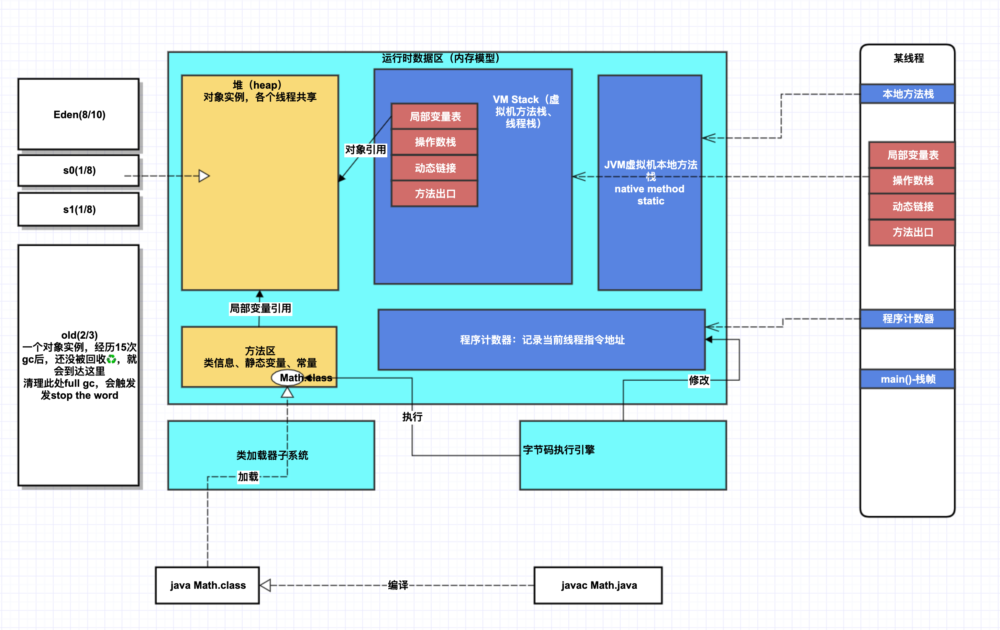

JVM内存分为5个区域：

| 名称                                   | 存储内容以及说明                                             | 是否各线程共享 |
| -------------------------------------- | ------------------------------------------------------------ | -------------- |
| <b>方法区（method area）</b>           | 类信息、常量、静态变量                                       | 是             |
| 堆（heap）                             | 所有线程共享 对象实例、数组 因此改区域经常发生垃圾回收♻️ | 是             |
| <b>虚拟机栈（VM stack）</b>            | 局部变量表、操作数、动态链接、方法返回等信息 当线程请求的栈深度超过虚拟机允许最大深度，则抛出 StackOverFlowError | 否，线程私有   |
| 本地方法栈（native method stack）      | native方法信息                                               | 否，线程私有   |
| 程序计数器（program counter register） | 当前线程的行号指示器 记录当前虚拟机真正执行的线程指令地址 | 否，线程私有   |

